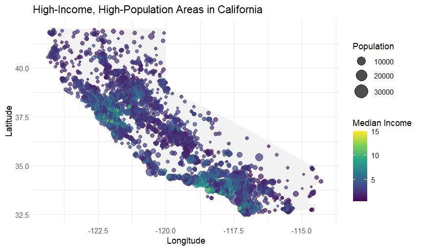

# California Demographic Analysis

## Overview

This project analyzes population and median income patterns across California using the California Housing dataset and geospatial visualization techniques in R. The objective was to identify regions that combine high population concentrations with higher median income levels and demonstrate how demographic data can support business decision-making.

## Tools Used

- R
- ggplot2
- dplyr
- maps

## Data Source

California Housing Dataset (derived from 1990 U.S. Census data)

https://www.kaggle.com/datasets/harrywang/housing

## Key Findings

The analysis identified several regions with both high population concentrations and higher median income levels, including:

- Los Angeles
- San Francisco Bay Area
- Sacramento

These regions may represent attractive markets for retail expansion due to the combination of population density and economic activity.

## Visualization

## Repository Structure

- `I123Project.R` – Data analysis and visualization script
- `Rplot05.png` – Final visualization output

## Business Application

This project demonstrates how demographic and geographic data can be used to support retail expansion, market analysis, and site-selection decisions. By combining population and income indicators, organizations can identify areas with strong consumer potential and prioritize locations for further evaluation.
